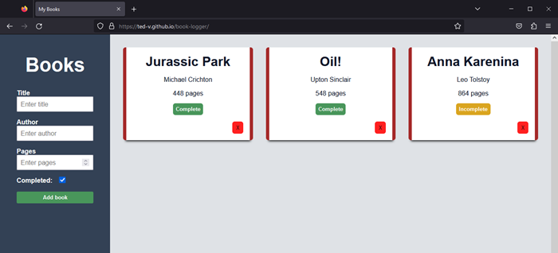
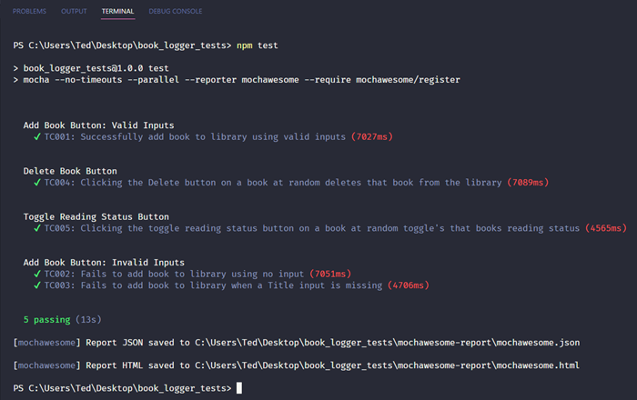
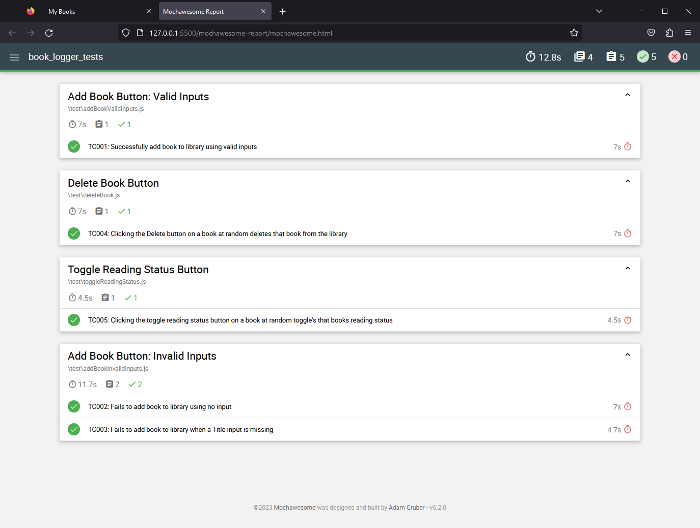
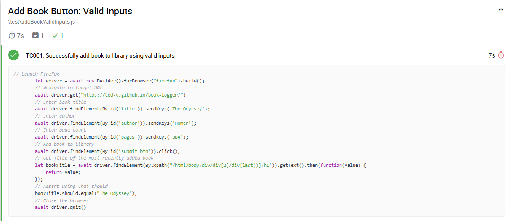

# Project Overview: Automated UI Testing with JavaScript, Selenium WebDriver, and Mocha

## About
This overview describes a personal project I created to help me learn Selenium WebDriver and Mocha Test Framework.

In this project, I used:
* Node.js to set up my project directory.
* JavaScript to write test scripts.
* Selenium WebDriver to automate mouse and keyboard events.
* Chai Assertions library to make assertions more readable.
* Mocha Test Framework to run my tests in parallel.
* Mochawesome to automatically generate test reports in HTML.

## What I Tested
I tested the UI functionality of a basic Book Logger app that I made. I developed this app as part of an online web development curriculum. The app lets users track their reading history. Users may add and remove books from the library. You can view the app live [here](https://ted-v.github.io/book-logger/). 

## Plan
To keep things simple, I focused on the following functional requirements:
* Users can add books.
* Users can remove books.
* Users can toggle the reading status of a book.
* Users CANNOT add a blank book.
* Users CANNOT add a book with no title.

To satisfy these requirements, I came up with 5 test cases. Here they are, briefly stated: 

| ID | Description                                                                                      | Steps                                                               | Expected Result                                                                           |
|---------|--------------------------------------------------------------------------------------------------|---------------------------------------------------------------------|-------------------------------------------------------------------------------------------|
| TC001   | Successfully add book to library using valid inputs.                                              | Fill out form with valid inputs and click Add Book.                 | New book appears in library.                                                              |
| TC002   | Fails to add book to library using no input.                                                      | Click Add Book.                                                     | Library catalog remains unchanged.                                                        |
| TC003   | Fails to add book to library when a Title input is missing.                                       | Fill out Author input and Pages input. Click Add Book.              | Library catalog remains unchanged.                                                        |
| TC004   | Clicking the Delete button on a book at random deletes that book from the library.                | Select a book at random and click its Delete button.                | The deleted book is no longer in the library.                                             |
| TC005   | Clicking the toggle reading status button on a book at random toggle's that books reading status. | Select a book at random and click its toggle reading status button. | The selected book's reading status changed from "Complete" to "Incomplete" or vice versa. |

Although these tests could easily be performed manually, the purpose of this project was to learn how to use Selenium WebDriver to automate them. I imagine these tests could be used in regression testing if I were to add more features to the app. 

I should note that I did not conduct cross-browser testing. One of the major preconditions for these tests is that they are performed in FireFox web browser. 

## Execution

I managed my project in Visual Studio Code and ran all my tests from the terminal using the `npm test` command. Each script employs Selenium's syntax to launch the browser, locate elements, interact with those elements, and then close the browser. 

Installing Mocha in my project with NPM made running my tests in parallel easy. All that was required was making some simple edits to my project's `package.JSON` file. Mochawesome, a package that automatically generates brief test reports in HTML, was set up just as easily.

This report was generated following test execution:

Sharing JavaScript files and code can be a pain. What makes these reports so useful is that they can easily be distributed to others. What's also neat is that you can click on any test script and examine the script's code. This is a great tool for collaboration. 

Here's what clicking on my first test script looks like: 

## What I Learned
* Scripting is fun.
* Reusing bits of code saves a lot of time when writing scripts.
* Testing is much easier when project requirements are clearly stated.
* Locating an element via XPATH is very useful in situations where you have to make calculations to determine what element to locate.
* The `findElements()` method returns a promise that contains a unique ID. This ID can come in handy when you're working with elements that are difficult to locate.

Thanks for reading. If you'd like, you can view my project files directly inside this repository. If you're interested in learning how to write basic test scripts in JavaScript with Selenium, you can find my tutorial here: https://github.com/Ted-V/portfolio/blob/main/resources/Selenium_JS_Tutorial/seleniumtut.md

